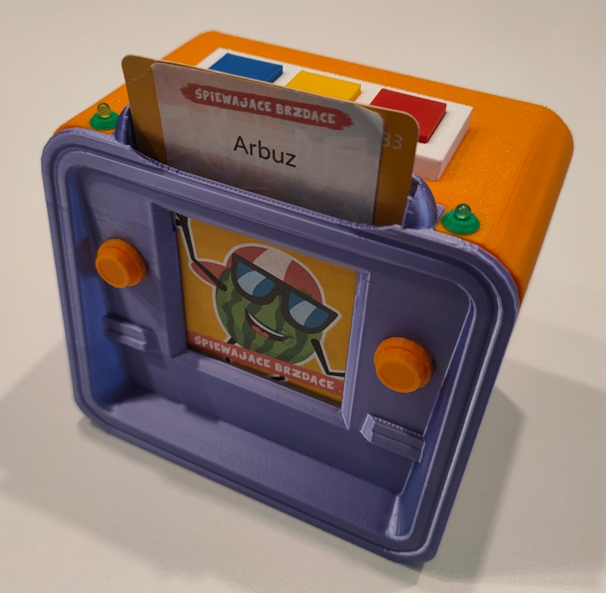

# Repository with raspberry pico projects

[Child Boom Box](#Child-Boom-Box)

[Proximity Faucet Controller](#Proximity-Faucet-Controller)

# Child-Boom-Box

An open-source, screen-free music player designed for toddlers and children who cannot read yet. The device uses physical cards with a simplified "barcode" to trigger audio files.



## How it Works
The player scans a [binary-encoded card](child-boombox/docs/sample_card_600dpi.png) (10-bit: Grey = 1, Black = 0, Least Significant Bit first) and plays the corresponding `.wav` file from the SD card. 
Note: actual code is scanned from card reverse. That's main cause that card have both sides printed. I got my cards from chinese educational flash card reader and just print stickers on them. There are many versions so make sure u order one with barcode looking like this [this](child-boombox/docs/sample_card_600dpi.png).
I use [script](child-boombox/docs/template.py) run from GIMP console to prepare stickers for songs from YT (12 per A4 sheet). Configure path to ffprobe and yt-dlp beforehand  

### Audio Specifications:
- **Format:** `.wav` files
- **Sample Rate:** 44100Hz, Stereo
- **Bit Depth:** Signed 16-bit PCM
- **Naming:** Files must be named after their scanned number (e.g., `42.wav`).

### System Sounds:
The following files are required on the SD card for system feedback:
- `hello.wav`: Played at power-up.
- `bye.wav`: Played before auto-sleep (after 1 minute of inactivity).
- `low_battery.wav`: Played on power-up if the battery is low.
- `insert_card.wav`: Played if a card scan fails.

---

## User Interface


| Control | Action |
| :--- | :--- |
| **Blue Button** | Replay the last played audio file. |
| **Yellow Button** | Cycle Volume: 20% → 40% → 80% → 100% → 80%... |
| **Red Button** | Wake from sleep / Stop current playback. |
| **Green LED** | Power indicator (On when active, Off in sleep mode). |
| **Yellow LED** | Activity indicator (Flashes on scans, button presses, or volume changes). |
| **Power Switch** | Main toggle to completely disconnect battery power. |

---

## Component List

- **Microcontroller:** Raspberry Pi Pico (RP2040)
- **Power:** 3xAA Battery Holder
- **Sensor:** Pololu QTR-MD-01RC Reflectance Sensor
- **Storage:** Adafruit MicroSD SPI/SDIO Card Breakout Board
- **Audio:** MAX98357 I2S 3W Class D Amplifier
- **Speaker:** 4 Ohm 3W Speaker (with JST 1.25mm terminal)
- **Wiring:** WAGO 221-415 (for 3.3V distribution), Micro JST 1.25mm 2-pin/3-pin cables
- **Buttons:** 3x 6x6mm Micro Momentary Tactile Switches
- **LEDs:** 2x 3mm LEDs (Green and Yellow)
- **Resistors:** 1x 100kΩ and 1x 22kΩ (for the amplifier voltage divider)

## Wiring Diagram:
```
Raspberry Pi Pico (Battery or USB Powered)
│
├── Battery Holder 3xAA:  
│   ├── Vcc (red) -> power switch -> VSYS + Audio Amplifier
│   ├── Gnd (black) -> Pico ground [PIN 38] + Audio Amplifier
│
│
├── Button #1 (blue):  
│   ├── V -> WAGO 221-415 -> 3V3(OUT) [PIN 36]
│   ├── G -> GPIO22 [PIN 29]
│
├── Button #2 (yellow):  
│   ├── V -> WAGO 221-415 -> 3V3(OUT) [PIN 36]
│   ├── G -> GPIO15 [PIN 20]
│
├── Button #3 (red):  
│   ├── V -> WAGO 221-415 -> 3V3(OUT) [PIN 36]
│   ├── G -> GPIO20 [PIN 26]
│
│
├── LED #1 (green):  
│   ├── V -> GPIO14 [PIN 19]
│   ├── G (optional resistor to reduce brightness) -> Any Pico GND [in my case PIN 13]
│
├── LED #2 (yellow):  
│   ├── V -> GPIO13 [PIN 17]
│   ├── G (optional resistor to reduce brightness) -> Any Pico GND [in my case PIN 18]
│
│
├── Reflectance Sensor:  
│   ├── GND → Any Pico GND [in my case PIN 8]
│   ├── CTRL → GPIO8 [PIN 11]
│   ├── OUT → GPIO09 [PIN 12]
│   ├── VCC -> WAGO 221-415 -> 3V3(OUT) [PIN 36]
│
│
├── MicroSD Card Board:
│   ├── 3V -> WAGO 221-415 -> 3V3(OUT) [PIN 36]
│   ├── GND -> Any Pico GND [in my case PIN 23]
│   ├── CLK -> GPIO18 [PIN 24]
│   ├── SO -> GPIO16 [PIN 21]
│   ├── SI -> GPIO19 [PIN 25]
│   ├── CS -> GPIO17 [PIN 22]
│
│
└── Audio Amplifier:
    ├── LRC → GPIO27 [PIN 32]
    ├── BCLK → GPIO26 [PIN 31]
    ├── DIN → GPIO28 [PIN 34]
    ├── SD → via voltage divider
    │    │── 100kΩ resistor -> GPIO21 [PIN 27]
    │    │── 22kΩ resistor -> Any Pico GND [in my case PIN 28]
    │
    ├── GND → Battery - (black)
    ├── V(in) → Battery + (red)
    │
    └── Speaker:
        ├── + → Micro JST 1.25MM Red
        └── - → Micro JST 1.25MM Black
```

## Assembly Instructions

### 1. 3D Printing
Print the following parts. Most parts do not require supports unless noted:
*   **Core Bottom:** Requires tree supports. Its recommended to paint black reflectance sensor back with permanent marker through mounting hole after print.
*   **Core Top:** Requires normal supports.
*   **LED Holder:** Print 2x.
*   **Push Button Cover:** Print 3x (ideally in Red, Yellow, and Blue).
*   **Others:** `electronic_holder`, `sensor_holder`, `tact_holder`, `tact_holder_cover`, `back_plate`.

### 2. Electronics & Soldering
1.  **Buttons:** Fit tact switches into the holder and solder wires. Ensure you use the correct legs for momentary contact.
2.  **Modules:** Secure the Pico (4x M2 screws), SD module (2x M2.5), and Amplifier (2x M2.5) to the `electronic_holder`.
3.  **LEDs:** Thread wires through the `core-top`, fit LEDs into their holders, and press them into the top casing.
4.  **Sensor:** Place the reflectance sensor in the `core-bottom` front slot and secure with the `sensor_holder` and small M1.2/M1.4 screws.
5.  **Final Connections:** Use a WAGO connector for the 3.3V rail. Ensure the battery holder wires are long enough to allow it to slide out for battery replacements.

### 3. Final Construction
1.  Mount the speaker and power switch to the `back_plate`.
2.  Screw the `electronic_holder` into the `core-bottom` (4x M2.5 screws).
3.  Slide the battery holder under the electronics.
4.  Align the `core-top` and `back_plate`, then secure the entire assembly using long M2 screws.

Check [assembly pictures](child-boombox/docs/3d_print)

Note: At low voltages system becomes unstable. That's why there is check of battery voltage on startup. I use AA batteries and determined more or less accurate threshold for batteries I use. If u want to use rechargable batteries or have issues change values at [vsys_voltage_reader.h](child-boombox/code/c/kid-boombox/components/vsys_voltage_reader.h)

---

## Known Issues
- **Hardware:** The current `back_plate.stl` is missing a cutout for the battery switch.
- **Power:** Sleep mode (Dormant) still draws significant power because the SD card cannot be fully powered down via software. A MOSFET for the SD card power line is recommended for future versions.
- **Stability:** Hard-cutting power with the switch while the unit is on can occasionally lead to SD card file corruption.
- **Logs:** SD card log rotation is currently inconsistent.

---

## Important Notes
- **Current Limit:** It is recommended to keep the draw on the Pico’s 3.3V (OUT) pin below 300mA. This is why the **Amplifier is powered directly from the batteries.**
- Consider powering the SD card directly from the battery rail in future revisions to reduce the load on the Pico's regulator.

---

# Proximity-Faucet-Controller

An automated, touchless sensor system retrofitted for standard faucets. This project was specifically designed for kitchen sinks used by elderly individuals to prevent water damage or waste caused by forgetting to turn off the tap.

## Features
- **Touchless Operation:** Uses an infrared proximity sensor to detect hands or objects.
- **Safety First:** Automatically shuts off water when the user moves away.
- **Normally Closed Design:** Solenoid valves are "Normally Closed" (NC), meaning water stays off if power is lost.

---

## Component List

### Control & Sensing
- **Microcontroller:** Raspberry Pi Pico (RP2040) running MicroPython.
- **Sensor:** E18-D80NK Infrared Proximity Sensor.
- **Logic Level Converter:** 4-channel bidirectional converter (5V to 3.3V).
- **Relay:** SONGLE SRD-05VDC-SL-C 5V Relay Module.

### Power & Water Control
- **Valves:** 2x 24V 6.3W Solenoid Valves (Normally Closed, e.g., RPE R Mini 4115BC).
- **Power Supply:** 24V 1A DC Adapter (5.5/2.1mm male connector).
- **DC Jack:** 5.5 x 2.1mm Female Jack Connector (for the 24V supply).
- **Pico Power:** Micro-USB Power Adapter.

### Hardware & Connectors
- **Connectors:** 2x WAGO 221-413 blocks.
- **Terminals:** 4x 6.3mm Female Spade Connectors with slip-on covers.
- **Wiring:** AWG22 cabling.

---

## Wiring Diagram:
```
Raspberry Pi Pico (USB Powered)
│
├── Proximity Sensor:
│   ├── VCC → VBUS (5V)
│   ├── GND → Any Pico GND
│   ├── OUT → Logic Converter → GPIO14 (with pull-up)
│
│
├── Logic Converter:
│   ├── VCC -> HV (5V)
│   ├── 3V3(OUT) -> LV (3.3V)
│
│
└── Relay Control:
    ├── GPIO16 → Relay IN
    ├── Relay VCC → VBUS (5V)
    ├── Relay GND → Pico GND
    │
    └── Relay Output:
        ├── COM → 24V+ 
        ├── NO → Solenoid Valves+   (Through Wago 221-413 connector)
        └── Solenoid Valves- → 24V- (Through Wago 221-413 connector)
```

---

## Installation Notes
1.  **Sensor Placement:** Mount the E18-D80NK sensor near the base of the faucet or under the cabinet lip where it can clearly "see" hands in the sink. It is recommended to place it at least few cm above countertop to avoid reflections from stainless steel sinks.
2.  **Valve Setup:** Install the solenoid valves in-line with your hot and cold water pipes. Ensure the flow direction matches the arrows on the valve bodies.
3.  **Safety:** Ensure the 24V power supply and the Pico are mounted in a dry location (e.g., inside the vanity cabinet) to avoid contact with water. Best is to use IPX5 electrical installation box as case.
4.  **Logic:** The code should listen for the sensor "OUT" signal. When the sensor is triggered (low/high depending on configuration), the Pico activates the relay, opening the valves. The water is cut if valve is on for few minutes (to avoid objects left before sensor, auto resets)

---

## Known Limitations
- Requires two separate power sources: USB for the Pico logic and 24V for the solenoid valves.
- Ensure the IR sensor is calibrated (via the screw on the back) to ignore the sink basin while detecting hands reliably.

---